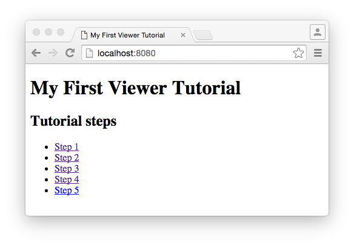
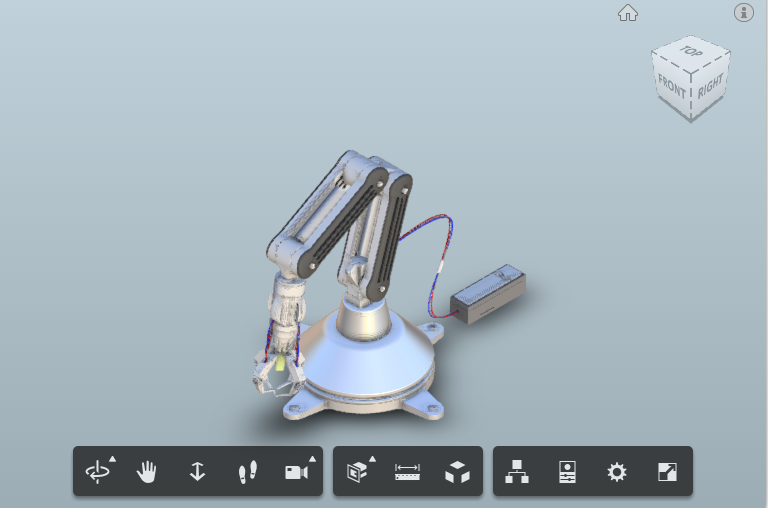

<a name="Step1"></a>
# Step 1 &ndash; Displaying a simple model

If you haven't done so already, download and unzip this tutorial somewhere on your local hard drive. You'll see that the folder structure conatins a set of folders names 'Step X', where X corresponds to the Step number on this tutorial page. Each of those folders contains the complete set of files you need to run each tutorial step. If you'd prefer to write the code as you go, then simply start in the 'Step 1' folder, and follow the instructions.

This tutorial assumes you have a way to serve local html files on a local server.

Hint: If you own a Mac, it comes with python installed. Just open the Termnal app, `cd` into the tutorial root directory and type `python -m SimpleHTTPServer`. Then open your web  browser and go to localhost:8000 to get to your page.

After launching your webpage, you should see a simple list of tutorial steps, like this: 

 
 
***Note &ndash; The files in this tutorial assume that the root tutorial folder is your webroot folder. Therefore, you should always start each tutorial step by launching the root folder index.html in your browser (as you just did) and clicking on the link to the step you want to run.***

Click on the Step 1 link to launch a webpage displaying the viewer. It should look like this:

 

Congratulations! You've just launched your first View & Data API enabled webpage &nbsp; :-)

Take some time to play with the viewer. Can you find and use these features:

* Zoom, pan and rotate.
* Select a component in the model (left-click).
* Isolate a component and then show all the model again (right click).
* The Explode tool.
* The Model Tree tool.
* The Object Properties panel.

# The code explained
Open up mainpage.html from the Step_1 folder (a subfolder of the tutorial root folder). The entire HTML (and JavaScript) code looks likem this:

```js
<!DOCTYPE html>
<html>
<head>
    <meta charset="utf-8">
    <meta http-equiv="X-UA-Compatible" content="IE=edge">
    <meta name="viewport" content="width=device-width, initial-scale=1">

    <title>LMV Viewer</title>

    <link rel="stylesheet" href="https://autodeskviewer.com/viewers/latest/style.css" type="text/css">
    <script src="https://autodeskviewer.com/viewers/latest/viewer3D.min.js"></script>


    <script>

    function initialize() {
        initializeViewer();
    }

    function initializeViewer() {

        //This is the location of the model the viewer will load
        // In this example, the model is local, so we don't need any server communication or authentication
        var options = {
            'document' : '../SampleModel/0.svf', 
            'env':'Local', 
        };
        var viewerElement = document.getElementById('viewer');
        var viewer = new Autodesk.Viewing.Private.GuiViewer3D(viewerElement, {});

        Autodesk.Viewing.Initializer(options, function() {
            viewer.start();
            viewer.load(options.document);
        });
    }


    </script>
</head>
<body onload="initialize()" style="margin:0">
	<div id="viewer"></div>    
</body>
</html>
```

The important bits for displaying the viewas are as follows:

First we reference the JavaScript and CSS file that define the viewer. This is hosted on the Autodesk server:
```js
    <link rel="stylesheet" href="https://autodeskviewer.com/viewers/latest/style.css" type="text/css">
    <script src="https://autodeskviewer.com/viewers/latest/viewer3D.min.js"></script>
```

The viewer itself is an HTML5 canvas element. This has to be set as a child of another DOM element &ndash; normally a `<div>` element. The element we're using to host the viewer is this one:

`<div id="viewer"></div>`

We initialize the viewer as the weppage loads by calling the JavaScript `initialize()` function:

`<body onload="initialize()" ...`

In thos example, the `initialize()` function simply calls anpother function - `initializeViewer()`. `initializeViewer()` is where all the work is done:

```js
    function initializeViewer() {

        //This is the location of the model the viewer will load
        // In this example, the model is local, so we don't need any server communication or authentication
        var options = {
            'document' : '../SampleModel/0.svf', 
            'env':'Local', 
        };
        var viewerElement = document.getElementById('viewer');
        var viewer = new Autodesk.Viewing.Private.GuiViewer3D(viewerElement, {});

        Autodesk.Viewing.Initializer(options, function() {
            viewer.start();
            viewer.load(options.document);
        });
    }
```

In this function, we:

* Define an `options` variable that has two parameters. 
  * The `env` parameter is set to local to tell the viewer that we're going to load a local model (i.e. a model hosted on our own server and not on the Autodesk server).
  * The `document` parameter is the path to the translated model we want to display (which is in the SampleModel subfolder of our tutorial root folder.
* Instantiate the `viewer` variable to a new instance of our viewer class, passing in the DOM element that will be its parent (that's the `<div>` we defined in the HTML `<body>`).
* Call the `Autodesk.Viewing.Initializer()` function to setup the viewer (this is defined in the `viewer3D.min.js` script we referenced earlier), passing in our viewer options and a callback function that will run when `Initializer` has finished.
* In the callback function, we tell the viewer to start up and then to load our model.

And that's it - those few lines of JavaScript code are all we need to add a beautiful, interactive 3D model to our webpage.

_(This code is particularly simple because we're loading a local model. The code is slightly different (and slightly more complicated) when we want to load a model hosted on the Autodesk server)._

Now let's start customizing the viewer.

=========================
[Home](README.md) | [Step 2](step-2.md)
