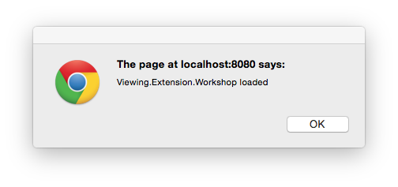

<a name="Step2"></a>
# Step 2 – Implementing a basic extension
(Don't forget to quit Mongoose before you continue).

The View & Data viewer exposes an 'extension' mechanism that allows you to customize the viewer's behvior by creating JavaScript extensions that can be loaded and unloaded as your viewer is running. In this step we'll put the code in place to load a barebones extension.

The extension we create will just display an alert to tell you when its been loaded.

## Create the extension

(If you're writing code as you go, you'll be modifying the code in the Step 1 folder and launching that page every time you want to review your work. If you'd prefer just to see the finished code, then you can just launch the Step 2 page from the root folder index.html page. Same deal for all the other steps too.)

Create a file named "Viewing.Extension.Workshop.js", and save it in the Step 1 folder. Then copy the following basic extension skeleton code into the file and save it:

```js
///////////////////////////////////////////////////////////////////////////////
// Demo Workshop Viewer Extension
// by Philippe Leefsma, April 2015
//
///////////////////////////////////////////////////////////////////////////////

AutodeskNamespace("Viewing.Extension");

Viewing.Extension.Workshop = function (viewer, options) {

    /////////////////////////////////////////////////////////////////
    //  base class constructor
    //
    /////////////////////////////////////////////////////////////////
    Autodesk.Viewing.Extension.call(this, viewer, options);

    var _self = this;
    var _viewer = viewer;


    /////////////////////////////////////////////////////////////////
    // load callback: invoked when viewer.loadExtension is called
    //
    /////////////////////////////////////////////////////////////////
    _self.load = function () {

        alert('Viewing.Extension.Workshop loaded');
        console.log('Viewing.Extension.Workshop loaded');

        return true;
    };

    /////////////////////////////////////////////////////////////////
    // unload callback: invoked when viewer.unloadExtension is called
    //
    /////////////////////////////////////////////////////////////////
    _self.unload = function () {

        console.log('Viewing.Extension.Workshop unloaded');

        return true;

    };

};

/////////////////////////////////////////////////////////////////
// sets up inheritance for extension and register
//
/////////////////////////////////////////////////////////////////

Viewing.Extension.Workshop.prototype =
    Object.create(Autodesk.Viewing.Extension.prototype);

Viewing.Extension.Workshop.prototype.constructor =
    Viewing.Extension.Workshop;

Autodesk.Viewing.theExtensionManager.registerExtension(
        'Viewing.Extension.Workshop',
        Viewing.Extension.Workshop);
```

The comments in the code should be self-explanatory. We're defining a class (`Viewing.Extension.Workshop`). We'll be loading this into the main viewer to customize the viewer behavior. The class includes several standard methods, including the `load()` and `unload()` methods that we can use to initialize the extension when the viewer loads it and clean up after ourselves if its unloaded. Of course, we can as any other methods and properties we like to this class.

##Reference and load the extension

Now reference the extension file in your mainpage.html file by adding the following script element to the header:

```js
<script src="Viewing.Extension.Workshop.js"></script>
```

This allows us to access our extension class from our main JavaScript code. Next, add code to load the extension into the viewer once it is initialized. If the extension relies on geometry in the model, you should set up an event to wait for the GEOMETRY_LOADED event, as some features may not be usable if the geometry in not fully loaded. (Its easiest just to always load the extension in response to that event).

In mainpage.html, locate the place where you load the model in your viewer code:

```js
       Autodesk.Viewing.Initializer(options, function() {
            viewer.start();
            viewer.load(options.document);
        });
```

Add the event handler to this function:

```js
        Autodesk.Viewing.Initializer(options, function() {
            viewer.start();
            viewer.load(options.document);
            
            viewer.addEventListener(
                Autodesk.Viewing.GEOMETRY_LOADED_EVENT,
                function(event) {
                    loadExtensions(viewer);
            });
            
        });
```

This event handler will invoke the `loadExtensions()` function when the viewer generates a `GEOMETRY_LOADED_EVENT`. 

Finally, add another method inside the script tags that loads the extension into the viewer:

```js
  function loadExtensions(viewer) {
    viewer.loadExtension('Viewing.Extension.Workshop');
  }
```

Your modified mainpage.html file should now look like this:

```js
<!DOCTYPE html>
<html>
<head>
    <meta charset="utf-8">
    <meta http-equiv="X-UA-Compatible" content="IE=edge">
    <meta name="viewport" content="width=device-width, initial-scale=1">

    <title>LMV Viewer</title>

    <link rel="stylesheet" href="https://developer.api.autodesk.com/viewingservice/v1/viewers/style.css?v=v1.2.22" type="text/css">
    <script src="https://developer.api.autodesk.com/viewingservice/v1/viewers/viewer3D.min.js?v=v1.2.22"></script>
    <script src="Viewing.Extension.Workshop.js"></script>

    <script>

    function initialize() {
        initializeViewer();
    }

    function initializeViewer() {

        //This is the location of the model the viewer will load
        // In this example, the model is local, so we don't need any server communication or authentication
        var options = {
            'document' : 'SampleModel/0.svf', 
            'env':'Local', 
        };
        var viewerElement = document.getElementById('viewer');
        var viewer = new Autodesk.Viewing.Private.GuiViewer3D(viewerElement, {});

        Autodesk.Viewing.Initializer(options, function() {
            viewer.start();
            viewer.load(options.document);
            viewer.addEventListener(
                Autodesk.Viewing.GEOMETRY_LOADED_EVENT,
                function(event) {
                    loadExtensions(viewer);
            });
        });
    }
        
    function loadExtensions(viewer) {
        viewer.loadExtension('Viewing.Extension.Workshop');
    }
    </script>
</head>
<body onload="initialize()" style="margin:0">
    <div id="viewer"></div>
</body>
</html>
```


## Test the extension

Now its time to test your application again. Navigate your browser to default (index.html) webpage in the tutorial root folder (i.e. browse to localhost:8080 or whatever port you setup for your local server), and then click on the Step 1 link if you're editing the  code as you go along (or Step 2 if you jst want to run the pre-prepared code). 

The viewer behaves the same as before, except you now see a dialog appear confirming that your extension has been loaded This is what it looks like in Chrome - it will look slightly different in other browsers:




=========================
[Home](README.md) | [Step 1](step-1.md) | [Step 3](step-3.md)